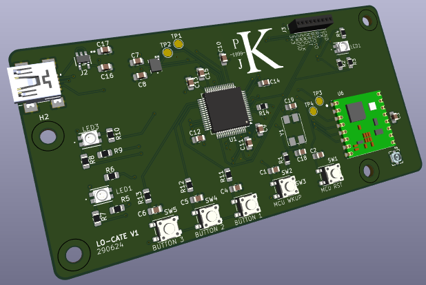

# lo-cate
A PCB and firmware project to create a simple LoRa capable device with an intergrated IMU. 
## PCB
The PCB was designed to be simple, power over USB and be manufactorable using basic electrical tooling.

### Overview
 - **LoRa**; Connected to the micro via SPI, the antenna connection is terminated to a U.FL SMD connector w/ track impedance matched to 50&Omega;
 - **IMU**; Connected to micro via SPI 
 - **Microcontroller**; STM32F401RET7 w/ an 8MHz external oscillator to allow USB OTG capabilities. 
 - **USB**; Mini B for communicating between the STM and external PC, 5v in fed into a 3.3v linear reg for use by all IC's
 - **LED's**; 3 RGB LED's connected to the micros power outputs for baic HMI
 - **Buttons**; Debounced using RC filter and connected to interrupt capable pins on the micro, MCU WKUP is connected to the micros sleep wakeup pin

### PCB TODO 
 - [] Change the Programming header for the STM32 from the 1.27mm pins
 - [] Fix the oscillator circuit to fit into the STM32 design guidlines C19 & C18 should be calculated via C_L = 2*(C_Load - C_Stray) also R14 can be removed from circuit 
 - [] Fix the LED footprints 

## Firmware 
